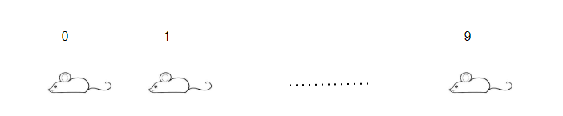
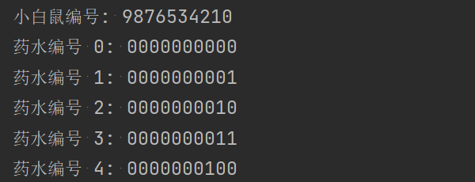

### 小白鼠喝药水


---


#### 题目 [^1]：

>现在有 10 只小白鼠和 1000 支药水，1000 支药水中有且仅有一支药水有毒，如果小白鼠喝下毒药，那么毒发的时间是两个小时。
>
>现在只给你俩小时的时间，请问如何用这 10 只小白鼠测出哪支药水有毒？（忽略小白鼠喝药的时间，每支药水足够每只小白鼠喝一口）

[^1]: 题目出处：https://mp.weixin.qq.com/s/lryAZ8C8_C3NS3qg8wh1kw

#### 解析：

10 如何能代表 1000？**二进制**。

小白鼠喝不喝药水，是两个状态；小白鼠是生是死，药水有没有毒，这些也是两个状态。

这些都可以用二进制的 0 和 1 表示。

把 10 只小白鼠编号，0 ~ 9，如图：



每只小白鼠有两种状态，10 只小白鼠加起来，2 的 10 次方是 1024，就有 1024 种状态，当然可以表示 1000 个数字了。

然后把 1000 支药水编号，0 ~ 999。

我们将药水编号转换成二进制，写 10 位（不够的前面补零）。

0 用二进制表示为：00 0000 0000

1 用二进制表示为：00 0000 0001

……

999 用二进制表示为：11 1110 0111

```python
print("小白鼠编号: 9876534210")
for i in range(1000):
	# print(i, bin(i))
	# print("{}: {:0>10}".format(i, bin(i)[2:]))
	print("药水编号 {0}: {0:010b}".format(i))
```




每一位对应着一只小白鼠。也就是说：

编号为 0 的小白鼠，喝药水编号的第 0 位是 1 的药水

编号为 1 的小白鼠，喝药水编号的第 1 位是 1 的药水

……

编号为 9 的小白鼠，喝药水编号的第 9 位是 1 的药水

这样，除了编号为 0 的药水，其他药水都被小白鼠喝了。

**情况一**：如果没有小白鼠死亡，那么编号为 0 的药水有毒。

**情况二**：如果有小白鼠死亡。

我们先反过来想一下，如果编号为 10 的药水有毒，10 用二进制表示为：00 0000 1010，所有可以得出有且仅有编号为 1、3 的小白鼠喝了这支药水，如果只有这两只小白鼠死亡，那么就可以判定编号为 10 的药水有毒。

如果编号为 1、3 的小白鼠最终死亡，其他小白鼠正常，那么有毒药水编号的第 1、3 位必定是 1，其他位必定为 0，即：2^1 + 2^3 = 2 + 8 = 10，有毒药水的编号是 10。

也可以使用另一种的方式计算，如果编号为 1、3 的小白鼠最终死亡，其他小白鼠正常，那么首先可以确定编号为 0 的药水没毒，然后其他小白鼠喝的药水也没毒。

首先排除这些没毒的药水，最终还有编号为 {2, 8, 10} 的药水无法确定是否有毒

然后在编号为 1、3 的小白鼠喝的药剂中找，已知 8 用二进制表示为：00 0000 1000，编号为 0 的小白鼠没有喝过这支药水（第 1 位 不为 1），可以确定这支药水也没毒，2 用二进制表示为：00 0000 0010，编号为 3 的小白鼠没有喝过这支药水（第 3 位 不为 1），可以确定这支药水也没毒，那么现在就只有编号为 10 的药水了，那就只有它有毒了。

#### 扩展：

思路是不是一下子扩展开了？是不是很巧妙？（生活中也有这样的例子，例如街边的算命先生，让你选几张纸就可以知道你的姓氏一样，其实用的也是二进制）

题目还可以有更多扩展，比如，2 个确定 4 个，3 个确定 8 个 ……

#### 代码：

##### 测试用例验证相关代码、回答问题函数代码模板

<details><summary>测试用例验证相关代码</summary>

```python
#!/usr/bin/env python3
# _*_ coding: utf-8 _*_
# 小白鼠喝药水

mouse_number = 10  # 小白鼠的数量
potion_number = 1000  # 药水的数量
mouse = list(range(mouse_number))  # 小白鼠的编号列表
potion = list(range(potion_number))  # 药水的编号列表
mouse_data = {i: [] for i in mouse}  # 记录每只小白鼠喝的药水编号
potion_data = {i: [] for i in potion}  # 记录每支药水被喝的小白鼠编号


def test_case():
	"""测试用例验证，假设每一支药水都有毒，分别验证结果"""
	# 实验，并记录实验数据：mouse_data、potion_data
	# print([bin(i) for i in potion[:10]])
	for index, p in enumerate(potion):
		p_bin = list(bin(p)[2:])  # 将编号转成二进制数，删除二进制的前缀：'0b'，再转成列表，方便颠倒
		# print(p, p_bin)
		for i, v in enumerate(reversed(p_bin)):
			if v == '1':  # 如果值为 '1'，说明这只小白鼠喝了这支药水，记录下来
				potion_data[index].append(i)
				mouse_data[i].append(p)
	# print("每支药水被喝的小白鼠编号：", [(k, v) for k, v in potion_data.items()], "\n")
	# print("每只小白鼠喝了哪些药水：", [(k, v) for k, v in mouse_data.items()], "\n")
	# print("每只小白鼠共喝了几支药水：", [(k, len(v)) for k, v in mouse_data.items()], "\n")

	# 假设每一支药水都有毒，通过有毒药水的编号、死亡小白鼠的编号列表，调用 answer() 函数验证结果
	for p in potion:
		death = potion_data[p]  # 喝了有毒药水的小白鼠死亡
		# print(p, death)

		poison = answer(death)  # 调用回答问题函数

		# 验证你给的答案，是否正确
		if poison != p:
			print(f"回答错误，有毒的药水是第【{p}】支，你的答案是第【{poison}】支。")
			exit(1)
		# else:
		# 	print(f"回答正确，有毒的药水是第【{p}】支。")
```

</details>

<details><summary>回答问题函数代码模板</summary>

```python
def answer(death: list) -> int:
	"""回答问题，返回问题的答案

	:param death: 死亡的小白鼠编号列表
	:return: 有毒药水的编号
	"""
```

</details>

##### 回答问题函数代码

方式一：

<details open><summary>回答问题函数代码</summary>

```python
def answer(death: list) -> int:
	"""回答问题，返回问题的答案

	:param death: 死亡的小白鼠编号列表
	:return: 有毒药水的编号
	"""
	if death:
		number = 0  # 定义一个初始编号，0 + 任何数，都等于任何数本身
		for d in death:
			number += 2 ** d
		return number
	else:
		return 0
```

</details>

方式二：

<details open><summary>回答问题函数代码</summary>

```python
def answer(death: list) -> int:
	"""回答问题，返回问题的答案

	:param death: 死亡的小白鼠编号列表
	:return: 有毒药水的编号
	"""
	# 如果有小白鼠死亡，继续判断；如果没有，有毒药水的编号为 0
	if death:
		no_death = set(mouse) - set(death)  # 没有死亡的小白鼠编号列表
		# print(death, no_death)
		number = set(potion) - {0}  # 需要确认是否有毒的药水集合，除了第一支没毒（都没喝，还有小白鼠死亡，说明这支没毒），其他所有药水都有嫌疑
		# 没有死亡的小白鼠喝过的药水，是没有毒的，可以排除
		for no_d in no_death:
			number -= set(mouse_data[no_d])  # 求差集
		# print(f"初步计算结果，有的药水的编号有：{number}")  # 还需确认是否有毒的药水
		# 在死亡的小白鼠喝过的药水中，找都喝过的药水，就是有毒的
		for d in death:
			number &= set(mouse_data[d])  # 求交集
			# print(number)
		# 有毒的药水有且仅有一个
		if len(number) == 1:
			poison = number.pop()
		else:
			print(f"解答失败，你最终排除结果，有毒药水的编号有：{number}")
			poison = number
	else:
		poison = 0
	# print(f"有毒药水的编号是：{poison}")  # 有毒药水的编号
	return poison
```

</details>

##### 验证

<details><summary>验证相关代码</summary>

```python
if __name__ == '__main__':
	test_case()
```

</details>

---

