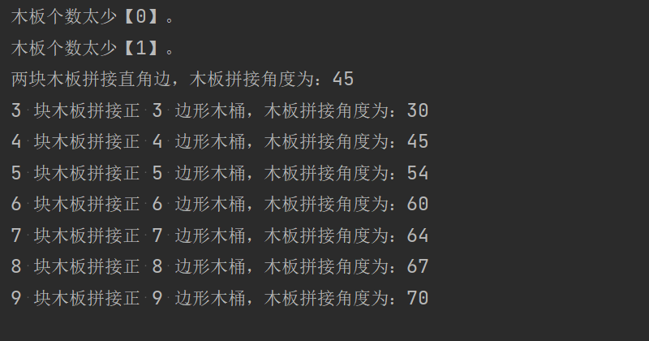

### 木板拼接木桶


---


#### 题目 [^1]：

>有几块木板，如何使用它们拼接成一个木桶，木板与木板之间拼接的角度是多少？
>
>正三边形木桶，正四边形木桶，正五边形木桶 ……

[^1]: 题目出处：无

#### 题解：

##### 思路：

已知，多边形内角和公式：(n - 2) * 180°

正三角形木桶，需要三块木板，每块木板的拼接角度为：(n - 2) * 180° / (2 * n)

##### 代码：

<details open><summary>代码</summary>

```python
#!/usr/bin/env python3
# _*_ coding: utf-8 _*_
# 木板拼接木桶

def test_case():
    """测试用例验证"""
    number = 10
    for n in range(number):
        answer(n)  # 木板个数


def answer(n: int) -> int:
    """回答问题，返回问题的答案

    :param n: 木板个数，即几个边的木桶
    :return: 木板拼接角度
    """
    if n < 2:
        print(f"木板个数太少【{n}】。")
    elif n == 2:
        angle = 90 // n
        print(f"两块木板拼接直角边，木板拼接角度为：{angle}")
    else:
        interior_angle_sum = (n - 2) * 180
        angle = interior_angle_sum // (2 * n)
        print(f"{n} 块木板拼接正 {n} 边形木桶，木板拼接角度为：{angle}")


if __name__ == '__main__':
    test_case()
```

</details>

输出：




---

